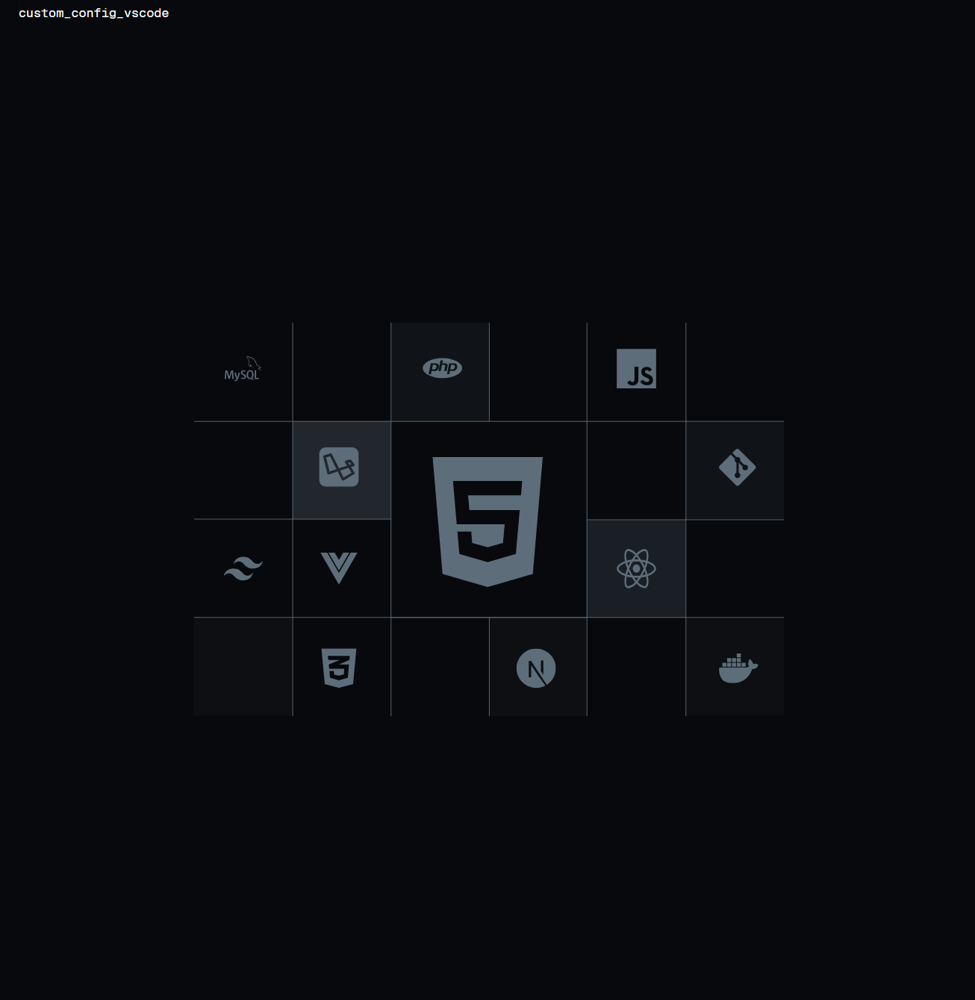
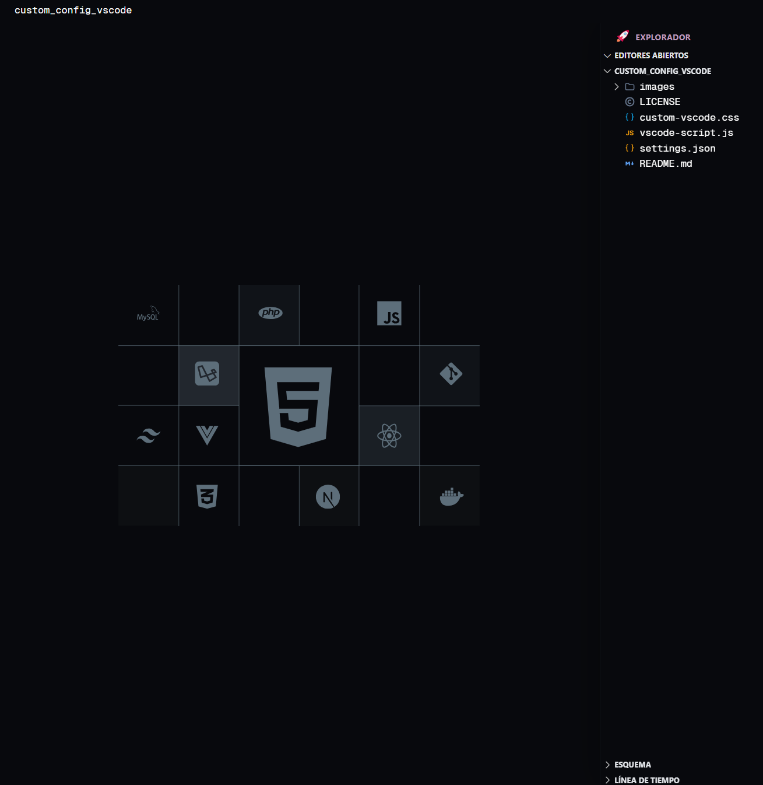
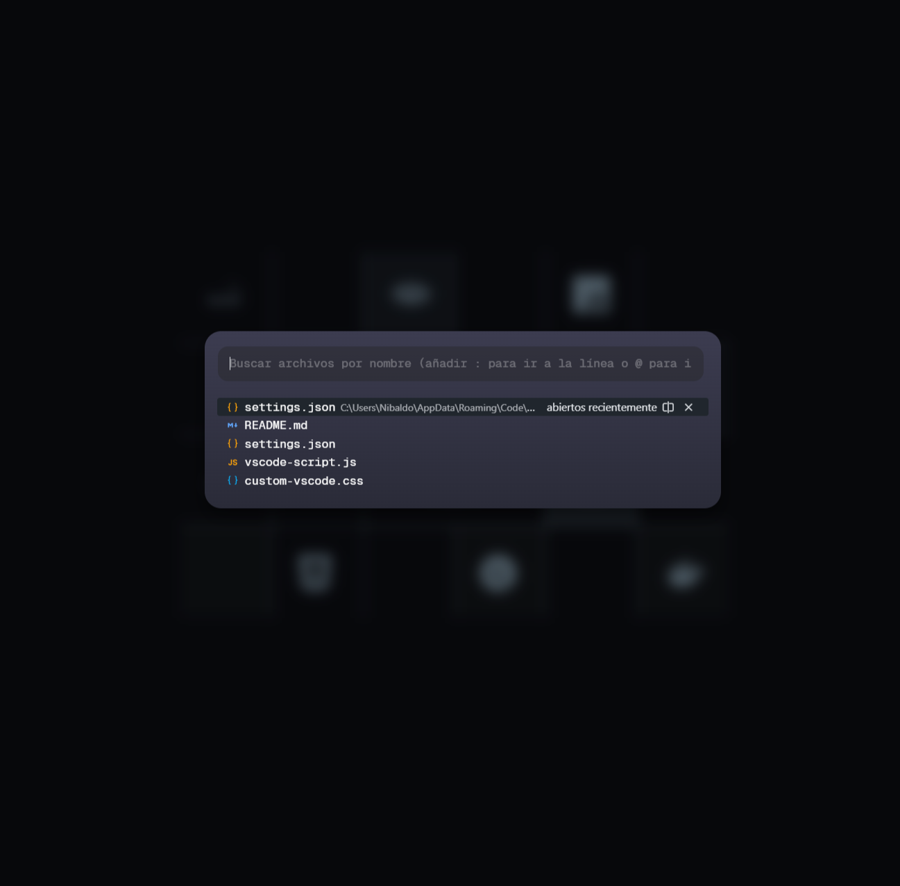

# My Custom and Personal VScode Configuration

This repository contains my custom and personal VSCode configuration, including custom CSS and JS files, settings, and extensions.

I have carefully curated this configuration to enhance my productivity and coding experience. Feel free to explore and use any parts that you find useful for your own setup.

## Requirements

- Custom CSS and JS files are used to modify the appearance and behavior of VSCode. To use these files, you need to install the [Custom CSS and JS Loader](https://marketplace.visualstudio.com/items?itemName=be5invis.vscode-custom-css) extension.

- Geist mono font is used in the custom CSS file. You can download it from [here](https://github.com/vercel/geist-font) or install it using `npm i geist`.

- This configuration use Focus Theme. You can install it from [here](https://marketplace.visualstudio.com/items?itemName=throwbly.focus).

- This configuration use Symbol Icons. You can install it from [here](https://marketplace.visualstudio.com/items?itemName=miguelsolorio.symbols).

- This configuration use Fluent Icons. You can install it from [here](https://marketplace.visualstudio.com/items?itemName=miguelsolorio.fluent-icons).

## Installation

1. Clone this repository to your local machine.

2. Replace the `settings.json` file in this repository with the one in your VSCode configuration directory. You can find the configuration directory by opening the command palette (`Ctrl+Shift+P`) and searching for `Preferences: Open Settings (JSON)`.

3. For use with the Custom CSS and JS Loader extension, change in your `settings.json` file to include the following:

    ```json
    "vscode_custom_css.imports": [

            "file:///path/to/your/repo/custom-vscode.css",
            "file:///path/to/your/repo/vscode-script.js"
        ],
    ```

4. Replace `/path/to/your/repo/` with the path to the cloned repository on your local machine.

5. Restart VSCode to apply the changes.

6. [Optional] The file `custom-vscode.css` have `.letterpress` class that is used to add a background image to the editor. You can replace the image with your own by replacing the SVG vector in the `custom-vscode.css` file.

## Customization

Feel free to customize the configuration to suit your preferences. You can modify the CSS and JS files, add or remove extensions, and adjust the settings as needed.

## Contributing

Contributions are welcome! If you have any suggestions, improvements, or bug fixes, please submit a pull request.

## License

This project is licensed under the [MIT License](LICENSE).

## Acknowledgements

- [Custom CSS and JS Loader](https://marketplace.visualstudio.com/items?itemName=be5invis.vscode-custom-css) extension by [be5invis](https://github.com/be5invis).
- [Geist Mono Font](https://github.com/vercel/geist-font) by [Vercel](https://vercel.com/).
- [Focus Theme](https://marketplace.visualstudio.com/items?itemName=throwbly.focus) by [throwbly](https://github.com/throwbly).
- [Symbol Icons](https://marketplace.visualstudio.com/items?itemName=miguelsolorio.symbols) by [miguelsolorio](https://github.com/miguelsolorio).
- [Fluent Icons](https://marketplace.visualstudio.com/items?itemName=miguelsolorio.fluent-icons) by [miguelsolorio](https://github.com/miguelsolorio).
- Original inspiration from [
Glenn Raya's VSCode configuration](https://github.com/glennraya/vscode-settings-json)

## Screenshots






